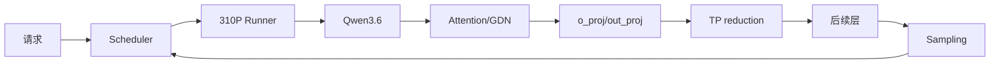
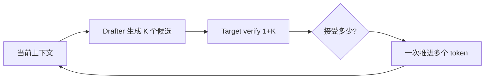
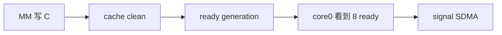
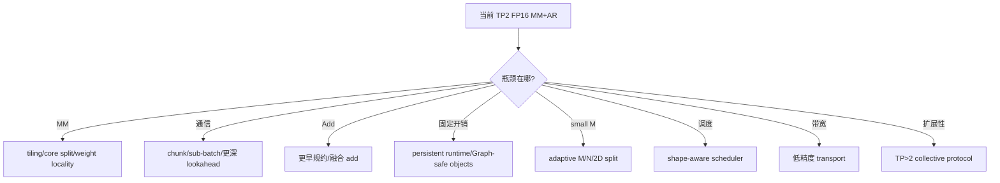

# 00｜主线故事：从一次 Qwen 请求到 MM+AR，再到下一代设计

> 这一篇要解决一个最重要的问题：**当前实现是怎么一步步“被问题逼出来”的，以及它为什么仍然不是终点。**

---

## 1. 起点：我们不是在优化一个 kernel，而是在优化一条在线推理链

固定场景：

```text
310P3 × 2
TP = 2
Tech/Qwen3.6-35B-A3B-w8a8
4K 左右输入，2K 左右输出
在线并发，例如 10
DFlash speculative decoding
```

用户看的是 TTFT、ITL、吞吐和稳定性；工程师需要把它拆成：



所以“最好”的标准从来不是某个 kernel 最快，而是：

```text
正确性不退化
+ 真实 workload 端到端收益
+ 可维护
+ Graph/并发/异常路径能活
+ 下一代还能继续演进
```

---

# 第一幕：vLLM 先解决“怎么喂饱硬件”

## 2. 为什么不能一请求一请求串行跑

在线请求长度不同：

```text
req A: 4K prompt + 2K output
req B: 800 prompt + 50 output
req C: 12K prompt + 500 output
```

如果每人独占模型，硬件利用率会很差。vLLM 用 Scheduler + continuous batching 把当前能执行的 token 拼成一轮 forward。

这时第一个关键认识出现：

> 用户看到的 `batch=10`，不等于某个 Linear 永远看到 `M=10`。

Prefill、Decode、chunk、speculative verify 都会改 M。

### 当前做法是不是最好？

Continuous batching 是当前系统的基础，但它不是“调度已经结束”。未来仍可演进：

```text
固定调度策略
   ↓
shape-aware scheduling
   ↓
communication-aware scheduling
   ↓
让 Scheduler 主动制造更适合 MM+AR / Graph 的 M 分布
```

这意味着以后 MM+AR 的优化甚至可能反向影响 Scheduler，而不是只在 kernel 内继续抠微秒。

---

# 第二幕：310P 不能只做“平台替换”

## 3. 为什么会出现 `_310p` 纵向定制

通用 vLLM 假设的 runtime、kernel、Graph、Triton 能力并不完全适配 310P。

因此当前工程把硬件特化放在多个层级：

```text
Patch / Worker / Runner
        ↓
Spec Decode / Graph / Metadata
        ↓
Quant route / custom op
        ↓
C++ runtime
        ↓
AscendC
```

### 为什么不是所有东西都 fork 一份？

完全 fork 上游模型代码虽然短期自由，但长期会造成：

```text
上游升级难
bug 修复难合入
310P 分支越来越孤立
```

当前思路更偏向“纵向窄切口”：只接管 310P 真正不同的部分。

### 未来更好的形态

理想演进不是让 `_310p` 越来越大，而是：

```text
平台差异 -> 清晰 capability/ABI
模型差异 -> declarative route
性能特化 -> 可注册 optimization pass
```

也就是从“patch 驱动”逐步走向“能力声明 + 策略选择”。

---

# 第三幕：Qwen3.6 的 TP 结构天然制造了 MM 后的 SUM

## 4. `o_proj/out_proj` 为什么重要

在 TP=2 Row Parallel 下：

```text
X = [X0, X1]
W = [W0; W1]

Y = X @ W
  = X0 @ W0 + X1 @ W1
  = Y0 + Y1
```

单 rank 只得到 partial：

```text
rank0: Y0 [M,2048]
rank1: Y1 [M,2048]
```

最后必须 SUM。

于是普通路径形成：

```text
MM partial
   ↓
完整写出
   ↓
通用 AllReduce
   ↓
下一算子
```

这条边就是融合机会。

---

# 第四幕：DFlash 一进来，优化问题变复杂了

## 5. Speculative decoding 不是独立优化，它改变下游 workload

DFlash：



好处是可能减少大模型 decode 轮数。

但代价是：

```text
一次 target forward 的 token 数改变
M 分布改变
Graph shape 分布改变
KV slot mapping 更复杂
```

这对 MM+AR 很关键，因为大 M 和小 M 的最佳 kernel 并不一样。

### DFlash 是不是一定最好？

不是。

它是否赚，取决于：

```text
acceptance rate
K
Drafter 开销
Target verify 开销
KV/Graph 准备成本
下游各算子的 M 敏感性
```

如果 acceptance 很低，或者 verify 放大了某些昂贵算子，speculative 可能不赚。

所以后面所有融合 benchmark 都必须放进 DFlash 的真实 M histogram 里看。

---

# 第五幕：为什么选择 o_proj 做 MM+AR

## 6. 数学允许按 batch 切开

因为：

```text
Y = Y0 + Y1
```

对行分块仍成立：

```text
Y[b] = Y0[b] + Y1[b]
```

于是：

```text
完整 MM -> 完整 AR
```

可以改成：

```text
MM batch0 -> send batch0
MM batch1 -> send batch1
...
```

如果通信能与后续 MM 重叠，就能缩短关键路径。

### 这是不是唯一、甚至最好的融合点？

不一定。

候选还有：

```text
QKV projection 周边
Attention 内部
MoE dispatch/combine 周边
更大的 transformer block 融合
Scheduler + communication 协同
```

当前选 `o_proj/out_proj` 的原因更务实：

```text
数学边界干净
SUM 语义明确
shape 稳定
调用频繁
上层接口变化小
reference 路径清楚
```

它是“风险/收益比不错的第一刀”，不是全局最优证明。

---

# 第六幕：数学上简单，硬件上却先要保证“谁真的算完了”

## 7. 8 核 cooperative MM 为什么出现

目标 shape 当前固定为：

```text
A [M,2048]
B [2048,2048]
C [M,2048]
```

大 M path 用 8 核 M-split：

```text
core0: 一段 rows
core1: 下一段 rows
...
core7: 最后一段 rows
```

所有核都做 MM，没有专门通信核。

### 为什么 core0 还负责 signal？

因为 signal 需要单 producer 语义，当前采用：

```text
core0 先算自己的 rows
等待 ready[0..7]
再调用 signal
```

不是把 core0 浪费成通信核。

---

## 8. `MM -> clean -> ready -> signal` 每一步保护什么



- MM：数据产生；
- clean：让 SDMA 可见；
- ready：证明某个 core 的区域完成且可见；
- signal：告诉通信侧可以搬。

### 能不能更好？

可能。

例如未来硬件/runtime 若提供：

```text
更直接的 producer completion primitive
设备侧 event
更强 cache coherence
按 tile 的 signal
```

ready cell 和显式 clean 的组织方式都可能重构。

但在当前硬件语义没有证据前，不能为了“少几个指令”删掉 correctness 边。

---

# 第七幕：正确以后，第二目标才是让计算通信重叠

## 9. 为什么不能每个 batch 都 `quiet`

最保守写法：

```text
P0 -> quiet -> W0 -> A0
P1 -> quiet -> W1 -> A1
```

它很容易把 pipeline drain 掉。

当前 lookahead=1 更像：

```text
P0
P1          || SDMA0
W0/A0       || SDMA1
P2          || ...
W1/A1
...
quiet
ack
```

### lookahead=1 是最好的吗？

没有这个结论。

可能存在：

```text
lookahead 0：资源紧/小 wave 反而更省
lookahead 1：当前简单平衡点
lookahead 2+：通信长尾足够大时可能更好
```

决定依据应是 profiler：通信是否真的藏在 MM 后面、队列深度是否造成反压、arena 是否够、wait 是否成为新瓶颈。

---

# 第八幕：为了复用内存和防止覆盖，引出了 wave/credit

## 10. arena 不是普通 buffer

多个 batch 共用固定通信区域：

```text
wave n:
  batch0 slot
  batch1 slot
  ...
```

下一 wave 不能在 peer 还没消费时覆盖它，于是：

```text
gate -> produce -> wait/add -> quiet -> ack
```

credit 管的是“整个 wave 是否可以复用 arena”。

### 有没有更好的协议？

候选包括：

```text
双/多缓冲 arena
ring buffer + sequence number
per-batch credit
更深流水的 window protocol
```

当前 wave credit 简单、可证明，但并不一定给最大并发深度。

演进前提是先量出：当前到底是 arena reuse 在挡流水，还是 MM/SDMA 本身已经是瓶颈。

---

# 第九幕：ACL Graph 把 runtime 设计重新限制了一遍

## 11. eager 正确，不代表 Graph 能 replay

Graph capture/replay 要求：

```text
固定或可复用地址
capture 前完成动态资源初始化
不能第一次进 kernel 才做昂贵初始化
replay generation 不能和 eager 混淆
```

所以当前有：

```text
capture 前 warmup
scratch/weight slice 预构建
Graph control clear
Graph fixed generation
eager 用高位区间 monotonic generation
```

### 更好的长期方向

当前 runtime 是“为了兼容 Graph 去管理很多状态”。更理想的方向是：

```text
Graph-safe resource object
显式 capture epoch
设备侧 generation namespace
更少 host 生命周期特殊分支
```

目标是把 Graph 从“特殊模式”变成同一套协议的另一种执行前端。

---

# 第十幕：small-M 打破“大 M 经验”

## 12. 为什么 M-split 在小 M 下不一定好

M 小时 8 核各自只算几行，但每核仍面对完整 B 的 weight-stream 成本。

于是性能不再近似：

```text
时间 ∝ M
```

固定成本开始占主导。

当前 small path 改成 N-split：

```text
core0 -> 256 columns
...
core7 -> 256 columns
```

每核只需要自己的 `[256,2048]` weight slice。

### N-split 是最终答案吗？

也不是。

未来可比较：

```text
1/2/4/8 core 自适应
M×N 二维切分
persistent weight cache
更小 T stair
直接输出 normal layout
MM 内直接规约部分 peer 数据
```

哪个更好必须看不同 M、DFlash K、并发和 Graph 下的 break-even。

---

# 第十一幕：真正的下一代不是“再优化 5%”，而是重新检查边界

## 13. 当前方案的演进树



这里最重要的不是列方向，而是**每个方向都有触发证据**。

例如：

```text
如果 SDMA 几乎完全被 MM 隐藏 -> 不要继续抠通信
如果 Add 出现在 critical path -> 才研究 add 融入/更早规约
如果 M<64 占 80% -> 优先 small path
如果 Graph replay 仍有 host 固定开销 -> 优先 runtime 生命周期
如果 TP 扩到 4 -> 当前 peer-exchange 架构需要重新设计，不是改 world_size 常量
```

---

## 14. 什么叫“最优”

至少要限定五个维度：

```text
硬件版本
CANN/runtime 版本
模型/量化
workload 分布
优化目标（吞吐/ITL/TTFT/资源占用）
```

因此工程上更准确的目标不是：

> 找到永远最优的 MM+AR。

而是：

> 建立一套**可测量、可推翻、可替换**的设计，使当前 workload 收益明确，并让下一轮优化有证据可循。

这就是后面 01～21 的真正学习目标。
