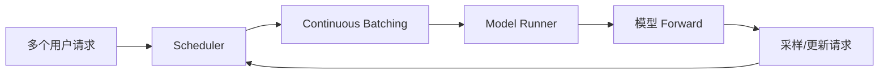
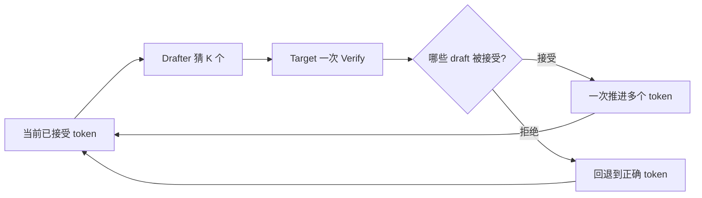
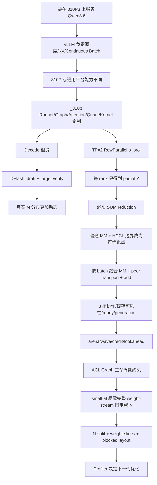

# 00｜主线故事：这个项目为什么一步步走到了 MM+AR 融合

> 这一篇不是知识点目录，而是整套学习材料的“故事主线”。
>
> 后面的 vLLM、310P、DFlash、Qwen3.6、TP、MemFabric、AscendC、Graph、small-M 都不是彼此独立的主题。它们都是在解决同一个问题：**怎样让 Qwen3.6-35B-A3B-w8a8 在 310P3 上既能正确服务，又能把真实推理关键路径压下来。**

---

## 1. 先设定一个贯穿全文的真实场景

以后读所有章节，都先想象我们正在服务这一组请求：

```text
硬件：310P3 × 2
并行：TP = 2
模型：Tech/Qwen3.6-35B-A3B-w8a8
输入：典型 prompt 约 4K token
输出：约 2K token
在线并发：例如 10 个请求
推理：开启 DFlash speculative decoding
```

这不是说运行时永远只有 `batch=10` 或 `M=10`。

vLLM 是 continuous batching，DFlash 又会让一次模型 forward 处理 `1+K` 个 verification token，所以真正进入某一层 Linear 的 `M` 会不断变化。

整个项目的故事，其实就是不断追问：

> **这一轮请求现在卡在哪里？为什么卡？310P 上应该在哪一层解决？**

---

## 2. 第一幕：先别优化 kernel，模型服务本身就很复杂

如果只有一个离线请求，我们可以简单地：

```text
prompt -> model -> token1 -> model -> token2 -> ...
```

但线上有 10 个并发请求，每个人长度不同，结束时间也不同。

于是第一个问题出现：

> 怎样让 NPU 不要因为请求长短不一而大量空转？

这就是 vLLM 先解决的问题：



所以我们学习 vLLM，不是为了背框架结构，而是理解：

```text
谁决定本轮 M 有多大？
谁准备 KV Cache 地址？
谁决定 Prefill 还是 Decode？
谁真正调用模型？
```

这对应后面的 01、02。

---

## 3. 第二幕：同一套 vLLM 不能原封不动搬到 310P

接下来模型要在 310P 上跑。

这时第二个问题出现：

> 上游通用实现里的算子、Graph、Triton、数据格式、量化路径，在 310P 上是不是都能直接用？

答案显然不是。

于是 vLLM-Ascend 和 `_310p` 定制层出现了。

它不是“给代码加一个 310P if”，而是在多个层面接管硬件相关逻辑：

```text
Worker / Runner
    ↓
Graph / metadata
    ↓
Attention / GDN / MoE
    ↓
Quantization routing
    ↓
Custom op
    ↓
C++ runtime
    ↓
AscendC kernel
```

这就是为什么项目里会有：

```text
vllm_ascend/_310p/
vllm_ascend/patch/worker/
csrc/_310P/
```

03、04 的作用，就是让你知道以后一个性能问题应该在哪一层解决，而不是所有问题都往 AscendC 里塞。

---

## 4. 第三幕：真正进入 Qwen3.6，一层里到底发生了什么

现在请求终于进入模型。

Qwen3.6 不是每一层都完全一样，当前代码会遇到：

```text
full_attention
linear_attention / GDN
MoE
```

但无论 full attention 还是 GDN，都会有一个“把 attention 结果投影回 hidden size”的 Linear：

```text
full attention  -> self_attn.o_proj
linear attention -> linear_attn.out_proj
```

这里第一次出现了我们后面真正关心的结构。

在 TP=2 下，它不是一张卡独立完成完整 Linear，而是 Row Parallel：

```text
rank0: Y0 = X0 @ W0
rank1: Y1 = X1 @ W1
final: Y = Y0 + Y1
```

shape 可以具体写成：

```text
全局输入 K = 4096
TP = 2

rank0 X0 : [M, 2048]
rank1 X1 : [M, 2048]

rank0 W0 : [2048, 2048]
rank1 W1 : [2048, 2048]

Y0/Y1    : [M, 2048]
最终 Y    : [M, 2048]
```

于是第一次出现了一个非常重要的事实：

> **MM 算完以后，这层还没结束。两张卡的 partial output 必须 SUM。**

这就是后面 MM+AR 的数学起点。

13 会沿着真实源码把这一层一路跟到底。

---

## 5. 第四幕：为了加速 Decode，我们又引入了 DFlash

如果普通 autoregressive decode 一次只验证/生成很少 token，大模型每一步都要跑一遍，Decode latency 很高。

于是又出现一个问题：

> 能不能先让便宜的 drafter 猜几个 token，再让大模型一次验证多个？

DFlash 就进入故事了。



但在 310P 上，DFlash 又不是简单照搬：

- Triton 路径要换成 AscendC；
- slot mapping 要正确；
- physical KV block size 可能按层不同；
- Graph 下动态地址计算还有限制；
- recurrent GDN buffer 又约束 speculative token 数。

这里有一个对 MM+AR 非常重要的副作用：

> **DFlash 改变了真实 workload 的 M 分布。**

所以你不能只拿一个固定大 M benchmark 判断 MM+AR 是否优秀。

05、14 就是在解释这件事。

---

## 6. 第五幕：Profiler 告诉我们，Attention 末尾还有一段不能忽视的串行路径

现在回到 `o_proj/out_proj`。

普通 TP 路径概念上是：

```text
MM partial
   ↓
写出结果
   ↓
HCCL AllReduce
   ↓
下一算子
```

如果这个节点：

- 每层都会出现；
- decode 每一步都会出现；
- MM 后紧跟 SUM reduction；
- TP 固定为 2；
- shape 很稳定；

那么一个自然问题就出现了：

> 为什么必须等整个 MM 完成，再启动一整个通用 AllReduce？

能不能：

```text
一部分 MM 完成
   ↓
这一部分先发给 peer
   ↓
AI Core 继续算下一部分
```

这才是本项目真正进入“计算通信协作优化”的转折点。

---

## 7. 第六幕：为什么偏偏选 o_proj，而不是哪里都融合

这里不是“看到 MM 后面有通信就融合”。

我们先问数学：

```text
Y = Y0 + Y1
```

因为 reduction 是线性的 SUM，所以可以把矩阵按行分块：

```text
Y_batch0 = Y0_batch0 + Y1_batch0
Y_batch1 = Y0_batch1 + Y1_batch1
...
```

因此：

```text
完整 MM -> 完整 AR
```

可以变成：

```text
MM batch0 -> transport batch0
MM batch1 -> transport batch1
...
```

而且 `o_proj` 的上层输入输出合同不用改变。

这就是一个好的融合边界：

```text
数学能拆
数据紧邻
调用频繁
shape 稳定
上层接口不变
有 stock reference 可以对照
```

15 会进一步拿 qkv_proj、整 Attention、MoE 等候选点来对比，而不是事后给 `o_proj` 找理由。

---

## 8. 第七幕：最简单的 MM+AR 方案一写，马上遇到一堆真实硬件问题

假设我们先写最朴素版本：

```text
MM
-> signal peer
-> wait peer
-> local add
```

数学对了，但工程上马上会冒出很多问题。

### 问题 1：一个 AscendC Matmul launch 怎么让 8 个 AI Core 真正共同算？

于是有了：

```text
8 core M-split
core b 负责自己的 rows
```

### 问题 2：core0 算完了，其他 7 核没算完怎么办？

不能 signal。

于是有了：

```text
ready[batch][core]
```

### 问题 3：AI Core 说“写完”不等于 SDMA 一定能读到最新数据

于是有了：

```text
MM write
-> cache clean
-> ready
```

### 问题 4：上一轮 ready=1，下一轮会不会误判？

于是有了：

```text
generation tag
```

### 问题 5：谁调用 signal？8 个 core 都调会怎样？

于是有了当前原则：

```text
8 核全部参加 MM
core0 也算自己的部分
等 8 个 ready 后
只有 core0 signal
```

这就是 16 的故事。

---

## 9. 第八幕：能正确通信以后，还要解决“怎么不把流水自己同步死”

如果每个 batch 都：

```text
MM
signal
quiet
wait
add
```

当然容易理解，但也可能把通信流水完全 drain 掉。

于是我们继续追问：

> 能不能让 batch0 的 SDMA 和 batch1 的 MM 同时发生？

当前 runtime 形成了 lookahead=1 的 enqueue 思路：

```text
P0
P1
W0 A0
P2
W1 A1
...
quiet
ack
```

其中：

```text
P = MM + signal
W = wait peer data
A = local add
```

这时又冒出新的资源复用问题：

> 下一 wave 能不能覆盖上一 wave 还在使用的 arena？

于是有了：

```text
arena
batch
wave
credit
gate
ack
```

这就是 17、19 的故事。

---

## 10. 第九幕：一上 Graph，又发现“普通 eager 正确”还远远不够

为了降低 launch 开销，服务路径还希望使用 ACL Graph。

但 Graph capture 有自己的约束：

```text
不能 capture 时临时 malloc
不能 capture 时第一次构建 weight slices
不能依赖每次 host rendezvous
固定 replay 又会重复 generation
```

于是 current runtime 被迫引入：

```text
capture 前 eager warmup
producer scratch 预分配
kernel symbol warmup
protocol init
Graph 内 clear ready control
Graph fixed generation
eager high-range monotonic generation
```

所以 Graph 不是附带特性，而是反过来塑造了 runtime 生命周期设计。

这也是为什么 `memfabric_mm_ar_runner_hooks.py` 这种看似不起眼的代码实际上很关键。

---

## 11. 第十幕：大 M 跑顺了，小 M 又把方案打回来了

最初 M-split 很自然：

```text
8 core 各算不同的输出行
每核都需要完整 B
```

但 Decode/DFlash 中经常出现小 M。

M 很小时：

```text
每核只有很少几行 A
却仍然要面对完整 2048×2048 weight 的读取/调度成本
```

于是 profiler 告诉我们：

> 算得少，不代表这个 M-split MM 就按比例变快。

这才逼出了 small-M N-split：

```text
M-split:
core0..7 切行，每核看完整 B

          ↓ 改成

N-split:
core0 负责 256 列
core1 负责 256 列
...
core7 负责 256 列
```

每核只保留自己的 `[256,2048]` weight slice。

于是又自然出现：

```text
T stair {16,32,64,128,256}
blocked [8][T][256] output
blocked add + unblock
weight slice cache
```

所以 small-M 路径不是“另写了一个花活”，而是**原 M-split 策略在真实 Decode workload 下暴露瓶颈后的第二代方案**。

这就是 18 的故事。

---

## 12. 第十一幕：到这里还不能说“已经最优”

项目做到今天，只能说明：

```text
当前设计在已有证据下解决了一组明确问题
```

不能说明：

```text
q=1 永远最好
lookahead=1 永远最好
small-M threshold=256 永远最好
FP16 transport 永远最好
TP>2 还能照搬当前方案
```

下一阶段必须继续问：

```text
真实 M 分布是什么？
MM 和 SDMA 到底有没有重叠？
重叠了多少？
瓶颈现在在 weight stream、SDMA、wait、add 还是协议固定成本？
q 变大是在提高效率，还是只是在延迟首批通信？
能否边搬运边规约？
需要 MemFabric 暴露什么新的 completion 粒度？
```

于是故事最终进入性能实验，而不是停在“代码写完”。

20 就是教你怎样继续推进这条故事线。

---

## 13. 把整个故事压缩成一张因果图



如果你能沿着这张图把“为什么下一步会出现”讲出来，就已经不是在背知识点，而是在理解项目的演进逻辑。

---

## 14. 后面所有章节都要挂回这条主线

建议不要再把章节理解成 20 个平级主题。

应该分成五幕：

```text
第一幕：先让模型成为一个可服务的系统
01 -> 02 -> 03 -> 04

第二幕：让 Decode 一次推进更多 token
05 -> 14

第三幕：从真实模型关键路径发现 MM+AR 机会
13 -> 06 -> 15

第四幕：把一个数学上简单的融合做成硬件上真的正确且可流水
07 -> 16 -> 17 -> 19 -> 18

第五幕：证明当前方案值不值得，并决定下一代往哪演进
10 -> 20
```

08、11、12 是工具型章节：源码地图、练习、自查术语，不属于主剧情。

---

## 15. 学习时始终用这六个问题推进故事

每遇到一个新机制，都不要先背名字，按这个顺序问：

```text
1. 上一步遇到了什么真实问题？
2. 这个问题是 correctness、性能，还是平台能力差异？
3. 为什么应该在当前这一层解决？
4. 当前方案具体改变了什么数据流/时序/内存？
5. 代价是什么？为什么没选另一种方案？
6. 哪个 profiler/实验结果会证明它应该继续保留或被替换？
```

这六问才是整套学习材料真正的主线方法。

最终你要掌握的不是“MemFabric MM+AR 这一个算子”，而是完整的方法：

```text
从真实服务 workload
  -> 找关键路径
  -> 判断融合是否合法
  -> 确定软件接入层
  -> 映射到硬件执行
  -> 建立同步与生命周期合同
  -> 用 profiler 推翻或验证设计
  -> 继续演进
```

这才是后续自己做第二个、第三个融合算子时真正能复用的能力。
