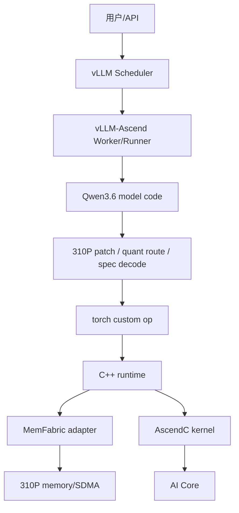
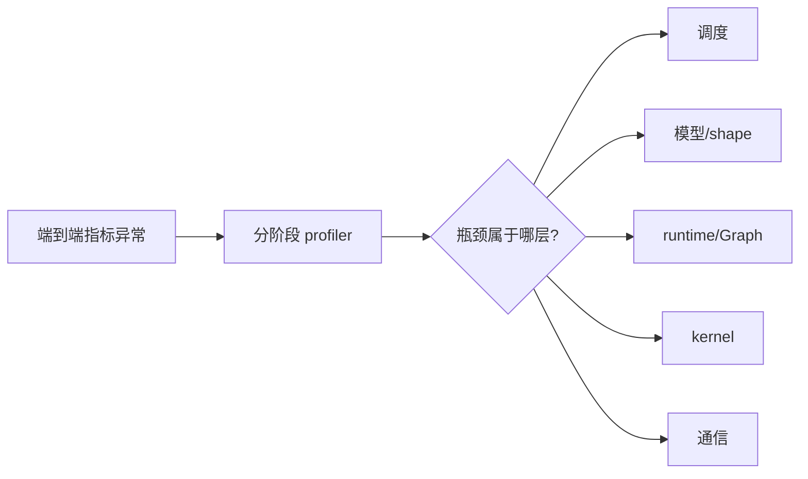

# 01｜先看懂全局地图：谁负责什么，问题应该在哪一层解决

> 本章位置：主线第一幕。先分清 vLLM、vLLM-Ascend、310P 定制、Qwen3.6、C++ runtime、AscendC 各自边界，否则后面很容易把所有性能问题都误认为“写 kernel”。

---

## 1. 一张分层图先建立世界观



把每层先理解成人话：

| 层 | 主要回答什么 |
|---|---|
| Scheduler | 这一轮哪些请求一起跑 |
| Runner | 怎样把本轮请求变成 tensor/KV/Graph 输入 |
| Model | 数学上这一层做什么 |
| 310P 特化 | 通用实现在哪些点不适配当前硬件 |
| custom op | Python 怎样进入定制算子 |
| runtime | 地址、生命周期、通信协议、Graph 状态怎么管 |
| AscendC | AI Core 真正怎么算 |
| MemFabric | 数据怎样跨 rank 搬、怎么 signal/wait |

---

## 2. 一个性能问题，先别急着写 AscendC

假设 ITL 变差，候选原因可能完全不同：

```text
Scheduler 形成的 M 太碎
DFlash acceptance 低
Graph 没命中
Python/C++ launch 固定开销
MM tiling 差
通信没重叠
Add 成了关键路径
```

正确调试方式：



这也是本项目把功能分层的原因。

---

## 3. vLLM 和 vLLM-Ascend 的关系

vLLM 主要提供通用推理服务框架：调度、KV Cache、请求生命周期、模型执行框架等。

vLLM-Ascend 做的不是重新发明 Scheduler，而是把“如何在昇腾设备上执行”接进去。

可以粗略理解：

```text
vLLM：决定今天要做哪批活
vLLM-Ascend：把这批活翻译成 Ascend 能高效执行的形式
```

310P 定制则是 vLLM-Ascend 内进一步针对 310P 的窄切口。

---

## 4. 为什么既有 Python，又有 C++，又有 AscendC

### Python

适合：

```text
模型路由
feature gate
tensor shape 检查
与 vLLM 接口对接
```

### C++ runtime

适合：

```text
设备资源生命周期
stream/Graph 状态
MemFabric context
arena/credit/generation
错误恢复/poison
```

### AscendC

适合：

```text
MM tiling
多核分工
ready/cache clean
wait/add
```

这不是语言偏好，而是职责分离。

---

## 5. 为什么 310P 定制最好做成“纵向切片”

当前结构希望做到：

```text
通用代码尽量不懂 310P 细节
310P 入口明确
底层实现可单独关闭
feature-off 仍能明确报错/回退
```

这样上游继续演进时，不需要维护一整份模型 fork。

---

## 6. 设计审视：当前分层是不是最好？

不是绝对最好，当前更多是兼顾落地速度和维护成本。

### 当前方案

```text
patch + _310p 模块 + custom op + 独立 csrc/_310P
```

优点：侵入较小，平台代码集中，容易 feature gate。

潜在问题：patch 多了以后依赖隐蔽；能力选择可能散落在不同文件。

### 可演进方向

```text
现在：大量“平台判断 + patch”
  ↓
下一步：统一 capability registry
  ↓
再下一步：optimization pass / route policy
  ↓
理想：模型代码声明语义，平台自动选择最佳实现
```

### 什么证据说明该重构？

当出现以下任一情况时，说明架构债开始大于收益：

- 同一个模型适配逻辑在多个 patch 重复；
- 新 CANN/vLLM 版本升级经常因为 monkey patch 失效；
- 一个算子的 feature gate 要跨很多层手工同步；
- 很难回答“当前某层最后到底走哪个实现”。

那时优先解决路由架构，而不是再加一个 patch。

---

## 7. 带着什么问题进入下一章

现在已经知道“谁负责什么”，下一章要真正跟一轮请求：

```text
10 个并发请求
   ↓
Scheduler 到底怎样形成这一轮 token？
   ↓
Runner 如何准备 KV/positions？
   ↓
为什么最终某个 Linear 看到的 M 不是固定 batch 数？
```
