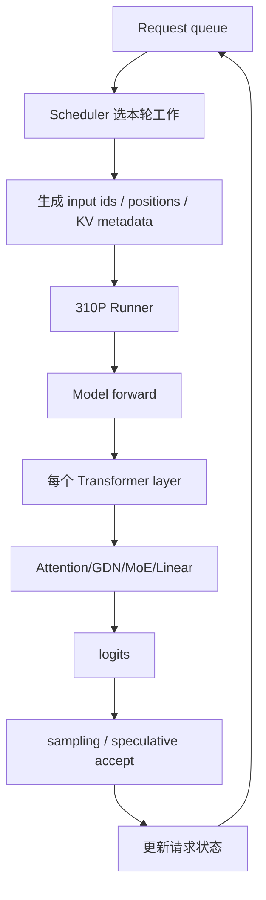

# 02｜一次请求端到端怎么跑：从 Scheduler 到某个 Linear 的 M

> 本章位置：主线第一幕。目标是把“一个用户请求”翻译成“这一轮设备上到底执行了哪些 token”，并理解为什么 MM+AR 最终面对的是动态 M，而不是固定并发数。

---

## 1. 先区分 Prefill 和 Decode

一个典型请求：

```text
prompt: 4096 token
output: 2048 token
```

### Prefill

第一次需要把已有 prompt 大量 token 一起送入模型：

```text
[t0,t1,...,t4095] -> model
```

### Decode

之后普通自回归通常每轮只向前推进很少 token：

```text
已知上下文 -> 算下一个 token -> 更新上下文 -> 再来一轮
```

这就是为什么同一模型会同时遇到“大 M”和“小 M”。

---

## 2. 10 个并发请求不等于 `M=10`

假设有 10 个请求：

```text
A: 正在 Prefill 512 个 token chunk
B~J: 各 Decode 1 token
```

某轮 model forward 可能看到：

```text
M ≈ 512 + 9
```

如果又启用 DFlash，每个 decode request 一次 verify `1+K` 个 token，M 还会继续变化。

所以以后看到：

```text
batch=10
```

一定追问：

> 指的是请求数、scheduled sequence 数，还是某个算子的 token 行数 M？

---

## 3. 一轮执行的概念路径



这里 MM+AR 只处在 G 的很小一段，但它会被每层、每轮反复调用。

---

## 4. KV Cache 为什么改变执行方式

如果每生成一个 token 都重新计算整个历史：

```text
1,2,3,...,4096
然后
1,2,3,...,4097
```

代价太高。

KV Cache 保留历史 attention 所需的 K/V，让 decode 只为新 token 计算新增部分，再访问历史缓存。

因此 Runner 除了准备 tensor，还必须准备：

```text
block table
slot mapping
positions
physical block information
```

后面 DFlash 之所以复杂，很大一部分就是因为这些地址关系不能错。

---

## 5. TP=2 以后，一次 Linear 又被拆成两张卡

以 RowParallel `o_proj` 为例：

```text
rank0: X0[M,2048] @ W0[2048,2048] -> Y0[M,2048]
rank1: X1[M,2048] @ W1[2048,2048] -> Y1[M,2048]
```

然后：

```text
Y = Y0 + Y1
```

所以一次请求的链路最终变成：

```text
Scheduler 形成 M
 -> 每个 rank 做 partial MM
 -> 跨 rank reduction
 -> 才能继续下一层
```

这就是为什么调度、模型 shape 和通信优化并不是三个孤立问题。

---

## 6. ACL Graph 在这条链里的位置

如果每轮 decode 都重新发起大量小 kernel，host launch 固定开销会很明显。

Graph 的基本思想：

```text
第一次：capture 一串设备操作
以后：replay 这串操作
```

但 Graph 不是“免费快进键”。它要求很多资源在 capture 前稳定下来，地址/shape/初始化需要满足 replay 条件。

这会直接影响 MM+AR runtime 的内存、generation、warmup 设计。

---

## 7. 设计审视：当前 Scheduler → Runner → Graph 是最好的吗？

不一定。当前架构主要追求通用性和可维护性。

### 可进一步演进的方向

```text
request-aware scheduling
    ↓
shape-aware scheduling
    ↓
Graph-bucket-aware scheduling
    ↓
communication-aware scheduling
```

例如：如果 profiler 证明某些 M 区间 MM+AR 特别高效，Scheduler 是否可以在不伤害公平性/延迟的前提下，更倾向形成这些 shape？

这是一种“系统级协同”，往往比单 kernel 再优化几微秒更有空间。

### 但为什么现在不先做？

因为它会改变请求调度语义、延迟公平性和整个执行框架，工程风险远高于局部算子融合。

所以当前项目先从局部、语义干净的 o_proj 入手，是风险更可控的演进顺序。

---

## 8. 进入下一章前要会回答

```text
为什么并发10不等于 M=10？
为什么 Prefill 和 Decode 对 kernel 的最佳策略可能不同？
为什么 DFlash 会进一步改变 M？
为什么 TP=2 后一次 Linear 还需要跨 rank SUM？
为什么 Graph 会反过来约束 runtime？
```
