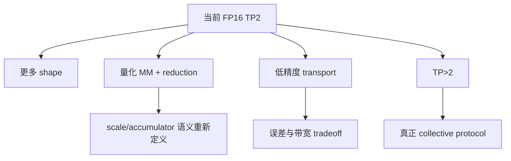

# 03｜Qwen3.6 模型、TP 与 W8A8：先把数学和 shape 钉死

> 本章位置：主线第一幕。MM+AR 能不能融合，首先是数学问题；性能优化之前必须先弄清 Qwen3.6 里到底是哪一层、哪种 TP、哪种 dtype。

---

## 1. 我们真正关心的不是整个模型，而是两类输出投影

当前 Qwen3.6 路径里会遇到：

```text
full_attention
linear_attention / GDN
MoE
```

其中和本次融合直接相关的是：

```text
full_attention  -> self_attn.o_proj
linear_attention -> linear_attn.out_proj
```

两者都承担“把 attention 结果投影回 hidden size”的角色。

---

## 2. Row Parallel 为什么天然带一个 SUM

假设全局 Linear：

```text
Y = X @ W
X: [M,4096]
W: [4096,2048]
```

TP=2 沿输入 K 维切：

```text
X = [X0, X1]
W = [W0; W1]
```

则：

```text
Y = X0@W0 + X1@W1
```

每张卡本地看到：

```text
X_rank      [M,2048]
W_rank      [2048,2048]
partial Y   [M,2048]
```

最终输出仍是：

```text
Y [M,2048]
```

所以 TP=2 后变小的是 K，不是 N。

---

## 3. `reduce_results=False` 为什么不是小优化

普通 RowParallelLinear 逻辑概念上是：

```text
local MM
 -> framework 做 TP reduce
```

MM+AR custom op 已经返回：

```text
Y0 + Y1
```

那上层必须关闭第二次 reduction：

```text
reduce_results = False
```

它表达的是：

> **TP reduction 的所有权从框架层转移到了融合算子内部。**

如果忘掉这件事，结果会被再次 SUM，直接错数。

---

## 4. W8A8 为什么这里仍然是 FP16 MM+AR

模型名带 `w8a8`，很容易误解为：

```text
所有 Linear 都是 INT8 × INT8
```

实际不是。

当前 ModelSlim 配置对目标 `o_proj/out_proj` 做了 skip，它们走 unquantized Linear 路径。本次融合合同因此是：

```text
activation: FP16
weight:     FP16
partial:    FP16
transport:  FP16
add:        FP16
```

所以“模型是 W8A8”和“这个算子是 FP16”可以同时成立。

---

## 5. 为什么必须先做 eligibility guard

不能只看到层名叫 `o_proj` 就替换。

当前融合实际上依赖一组强前提：

```text
平台 = 310P
feature enabled
TP = 2
目标模型/目标层
unquantized projection
K/N/shape 满足合同
无 bias
dtype 满足合同
```

人话说：

> custom op 是一条“窄而快”的高速路，不是万能 Linear。

合同不满足就应该继续走通用路径。

---

## 6. NZ 是什么，为什么 weight 会涉及它

Ascend Matmul 往往不是直接用普通二维 ND weight 做最终计算，而会使用更适合硬件搬运/计算的数据布局，例如 NZ。

可以把它理解成：

```text
数学上的矩阵没变
但物理内存排布为了 AI Core 更高效而重排
```

这也是为什么后面 small-M N-split 不只是“改两个循环”，还要准备每核自己的 weight slice/layout。

---

## 7. 设计审视：当前只融合 FP16 o_proj 是不是保守过头？

是有意保守。

### 为什么当前这样做

先选：

```text
数学简单
shape 固定
dtype 固定
无 bias
TP=2
```

能把复杂度集中在“计算通信协作”，而不是同时解决量化 scale、dtype conversion、不同 TP collective 等问题。

### 可以怎么演进



### 量化版为什么不是简单换 dtype

如果 MM 是 INT8/W8A8，可能涉及：

```text
scale 在哪里乘？
partial 用 INT32 还是 FP16？
两 rank 在量化域还是反量化后 SUM？
transport 什么 dtype？
误差怎样与 reference 对齐？
```

所以它是下一阶段独立设计题，不应该硬塞进当前 FP16 版本。

---

## 8. 本章留下的问题

现在数学上已经知道：

```text
partial MM 后必须 SUM
```

下一步要回答：

> 310P 平台怎样把这些模型语义、量化路由和定制 custom op 接进现有 vLLM-Ascend，而不把通用代码搞乱？
