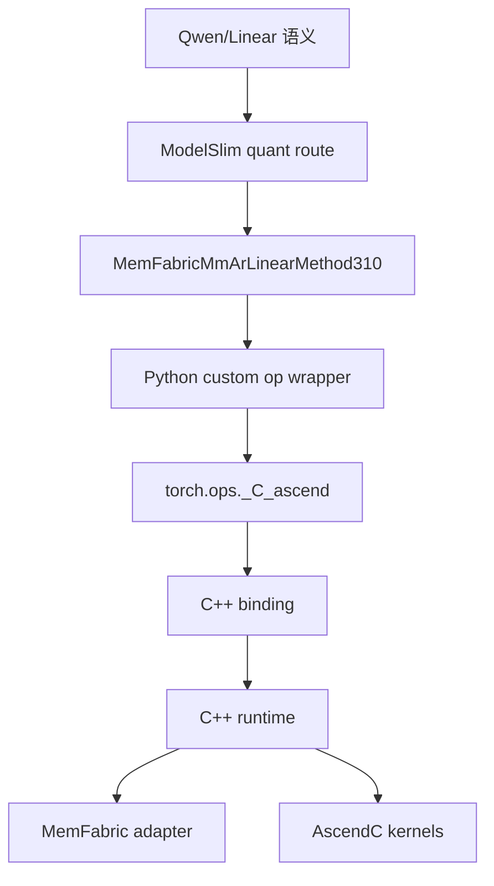

# 04｜310P 定制能力是怎么接进去的：从 patch 到 custom op

> 本章位置：主线第一幕收尾。目标不是背目录，而是理解“一个 310P 特性从框架到设备”怎样纵向落地，以及为什么需要适配层而不是直接把所有实现塞进模型文件。

---

## 1. 一条能力从上到下经过哪些层

以 MM+AR 为例：



每层只解决自己最适合的问题。

---

## 2. patch 层是干什么的

310P 需要对上游通用执行路径做一些“定点接管”，例如：

```text
DFlash input preparation
Qwen3.6 相关 worker/model 行为
Graph/runner 特化
```

`vllm_ascend/patch/worker/` 的价值是把平台差异集中起来，而不是把 310P 条件分散到所有通用模块。

但 patch 本身不是终极架构，它更像兼容既有框架的工程手段。

---

## 3. quantization route 为什么会决定 MM+AR 是否接管 Linear

目标 checkpoint 总体 W8A8，但目标 projection 被 skip，走 unquantized path。

`vllm_ascend/_310p/quantization/modelslim_config.py` 在这里可以把满足合同的层切到 310P MM+AR LinearMethod。

概念上：

```text
这个 Linear 是目标层？
  ↓ 是
dtype/shape/TP/feature 满足？
  ↓ 是
使用 MemFabric MM+AR method
  ↓
并告诉上层：结果已经 reduce，不要再 reduce
```

这叫“路由”，不是在模型 forward 里硬编码算子名。

---

## 4. Python wrapper 的职责

`vllm_ascend/_310p/ops/memfabric_mm_ar.py` 应尽量薄：

```text
检查输入合同
把必要参数传给 custom op
返回 tensor
```

设备资源、通信状态、Graph generation 不应该堆到 Python tensor wrapper 里。

---

## 5. C++ binding 为什么还要 feature-off 实现

binding 注册类似：

```text
memfabric_mm_ar_allreduce(Tensor x, Tensor weight,
                          int tp_rank,
                          int batch_basem_count) -> Tensor
```

即使编译时没启用 MemFabric，也保持算子 schema/注册存在，调用时给出明确错误。

好处是：

```text
Python import/registration 不因为 feature-off 崩坏
问题更容易定位
build feature 和 runtime route 解耦
```

---

## 6. 为什么需要 adapter ABI

C++ runtime 直接依赖 MemFabric 私有内部结构会造成强耦合。

adapter 的思想：

```text
vLLM MM+AR runtime
       ↓ 只看稳定 ABI
memfabric310p_adapter_api.h
       ↓
MemFabric 实现
```

vLLM 只使用需要的公开能力，例如：

```text
context/layout
prepare wave
signal/wait
ack/quiet
small path 相关入口
```

不去猜 private mailbox/ring 的内部实现。

### 人话解释 ABI

ABI 就像“插头尺寸和针脚定义”。

只要双方遵守：

```text
这个函数叫什么
参数是什么
结构体怎么排
返回值是什么意思
```

两边内部都能继续演进。

---

## 7. runtime 为什么不能省掉直接从 binding 调 kernel

MM+AR 不是一次 stateless kernel launch，它要长期持有：

```text
MemFabric context
symmetric layout
arena
scratch
weight slice cache
q
Graph capture state
generation/wave sequence
poison state
```

这些是“一个 worker 生命周期内的协议状态”。

因此需要 C++ runtime 作为状态机，而不是让每次 Python 调用临时重建。

---

## 8. 设计审视：当前纵向接入是不是最好？

### 当前方案的优点

- 改动聚焦在 `_310p` 和 `csrc/_310P`；
- 上层模型侵入少；
- build/runtime feature 可隔离；
- runtime 和 MemFabric 通过 ABI 隔开。

### 当前方案的债

- patch 越多，真实调用路径越难肉眼追踪；
- eligibility 规则如果分散，容易出现“Python 认为能跑、runtime 认为不能跑”；
- ABI version 演进需要纪律。

### 更好的演进方向

```text
当前：patch + scattered guards
   ↓
统一 310P capability registry
   ↓
每个优化声明：语义、shape、dtype、TP、Graph 能力
   ↓
框架在 load/capture 前完成 implementation selection
```

最终让“为什么这层走 MM+AR”变成可查询的决策，而不是读很多 if 才知道。

---

## 9. 下一章为什么转向 DFlash

平台路径已经通了，但 Decode 仍然要一轮轮执行大模型。

下一问变成：

> 能不能一轮推进多个 token？如果能，310P 上要改哪些输入/KV/Graph 逻辑？这又会怎样改变 MM+AR 的 workload？
