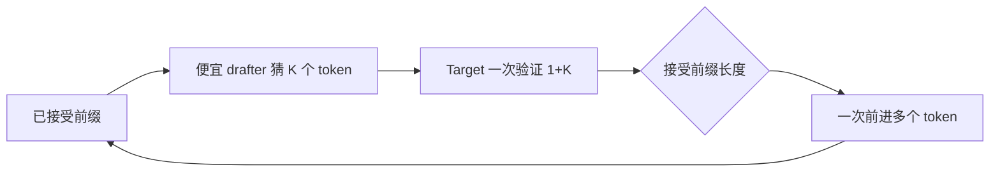

# 05｜投机推理：DFlash 怎么工作，为什么它会反过来影响 MM+AR

> 本章位置：主线第二幕。DFlash 不是与 MM+AR 无关的“另一个优化”；它会直接改变 target model 每轮处理的 token 数，也就是很多 Linear 看到的 M 分布。

---

## 1. 普通 Decode 为什么慢

普通自回归：

```text
已有上下文
  ↓
大模型 forward
  ↓
生成 1 token
  ↓
把 token 加回上下文
  ↓
再跑大模型
```

如果输出 2000 token，就要反复执行很多轮大模型。

---

## 2. Speculative decoding 的核心不是“猜得快”，而是“少跑几轮 target”

基本思路：



如果 drafter 猜得准，target model 一次 forward 能推进多个 token。

---

## 3. DFlash 在系统里改变了什么

它至少同时改变：

```text
本轮 token 数
positions
request id 展开
slot mapping
block table 访问
verification/accept 流程
Graph shape
```

所以 speculative decoding 绝不是只在 sampling 末尾多一个 if。

---

## 4. 为什么 310P 需要自己的 DFlash 输入准备

通用实现中某些输入构造依赖 Triton；310P 路径不能简单照搬。

当前 `_310p/spec_decode/dflash_proposer_310.py` 用 AscendC custom op 完成对应 copy/expand 工作，并通过 310P patch 接到共享 proposer 逻辑。

思路是：

```text
共享 DFlash 算法
      ↓
平台相关 input materialization
      ↓
310P 用自己的高效实现
```

这样不会把整个 DFlash fork 成 310P 专版。

---

## 5. 为什么 physical KV block size 是个容易错到很隐蔽的点

slot mapping 最终要告诉 attention：

```text
“这个逻辑 token 的 K/V 真正存在哪个物理槽位？”
```

如果不同层的物理 block size 不同，而代码错误地使用一个全局 block size：

```text
逻辑位置没错
但算出来的物理地址错
```

结果可能不是立刻 crash，而是读错/读空 KV，表现成：

```text
acceptance 异常
输出质量异常
偶现错数
```

因此 DFlash correctness 首先是地址问题，不只是概率算法问题。

---

## 6. 为什么 speculative token 当前有上限

310P recurrent GDN 相关 kernel 预留的最大 query 长度是 16；target verify 还要包含 bonus token，因此当前 draft token 上限是 15。

这不是一个“DFlash 理论常数”，而是当前实现和底层 buffer/shape 合同共同形成的工程约束。

---

## 7. DFlash 为什么改变 MM+AR 的 M

假设普通 Decode 有 10 个 active request：

```text
普通：每个请求约 1 行 -> M≈10
```

如果每个请求 target verify `1+K=5`：

```text
可能接近 M≈50
```

实际还会受调度、请求状态和接受情况影响，但结论是：

> speculative decoding 会把下游 Linear 从“极小 M”推向一组新的小/中 M 分布。

因此 small-M threshold、q、Graph bucket 都应该用 DFlash 开启后的真实 histogram 调。

---

## 8. DFlash 是不是越大的 K 越好？

不是。

一个简单收益模型：

```text
每轮推进收益 ≈ accepted_tokens
每轮成本 ≈ drafter + target_verify(1+K) + metadata + sampling
```

K 变大：

```text
潜在一次推进更多
但 target M 更大
KV/metadata 更多
猜错的浪费更多
Graph/shape 更复杂
```

最优 K 是 workload 相关的。

---

## 9. 设计审视：DFlash 之外还有什么方向

不能把“开启 speculative”当成唯一演进线。

候选维度包括：

```text
更好的 drafter / acceptance
动态 K
不同 speculative algorithm
普通 Decode + 更强 Graph
调度与 speculative 联动
```

### 什么情况下要重新评估 DFlash？

如果出现：

- acceptance 持续偏低；
- drafter 时间占比过高；
- verify 把 M 推到一个更差的性能区间；
- KV/metadata 成为新瓶颈；
- 端到端 ITL 没改善甚至恶化。

那就不能因为“speculative 理论上先进”而保留它。

---

## 10. 下一步

现在我们知道 DFlash 改变了真实 workload。接下来要回到 Qwen3.6 一层源码，确认：

```text
hidden_states 从哪里来
full attention/GDN 怎样走
o_proj/out_proj 在哪里
TP reduction 原来由谁做
```

只有把真实调用链走通，才能严谨选择融合点。
