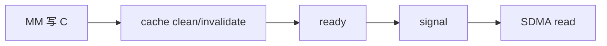

# 07｜MM+AR 融合算子完整设计：从数学等价到计算通信流水

> 本章位置：主线第四幕入口。这里先给完整设计全景；后面的 16～19 会把 kernel、runtime、MemFabric、Graph 分别拆开。

---

## 1. 目标合同

当前主路径可以抽象成：

```text
输入 A_rank : [M,2048] FP16
权重 B_rank : [2048,2048] FP16
本地 partial: [M,2048]
TP = 2
最终输出    : Y0 + Y1
```

普通实现：

```text
local MM -> framework AllReduce -> output
```

融合实现：

```text
local MM 分批产生 partial
 -> 每批尽早 signal peer
 -> peer 数据到达后 local add
 -> 直接返回 reduced output
```

---

## 2. 为什么 baseM=256、q 又是什么

当前定义：

```text
baseM = 256
q = batch_basem_count ∈ {1,2,4}
batch_m = 256 * q
```

对应 FP16、N=2048 的单 batch payload：

```text
q=1: 256*2048*2B = 1 MiB
q=2: 2 MiB
q=4: 4 MiB
```

重点：

> “2MiB”不是协议常数；真正的协议粒度由 `baseM × q × N × dtype` 决定。

---

## 3. 大 M 路径：8 核 M-split

每个 batch 共有 `batch_m` 行，8 个 AI Core 分行：

```text
core b:
rows [b*batch_m/8, (b+1)*batch_m/8)
```

图示：

```text
C batch
+---------------------+ core0
+---------------------+ core1
+---------------------+ core2
+---------------------+ ...
+---------------------+ core7
```

所有 8 核都做 MM。

core0 不是专职通信核；它先完成自己的 MM，再等所有 ready，然后做唯一 signal。

---

## 4. 为什么需要 ready cell

如果 core0 自己算完就 signal：

```text
core0 done
core1..7 可能还在算
      ↓
signal
      ↓
SDMA 开始读整个 batch
```

会读到未完成数据。

因此每核完成自己的 C rows 后：

```text
MM
 -> cache clean
 -> ready[batch][core] = generation
```

core0：

```text
wait ready[0..7] == generation
 -> signal
```

这里 ready 只做卡内 8 核协调；跨卡通知由 MemFabric signal/wait 负责。

---

## 5. 为什么 ready 前还有 cache clean

“AI Core 写完”不自动等价于“SDMA 一定看到最新 GM 数据”。

所以正确性链是：



交换 B/C 或删除 B 都必须有硬件一致性证据，否则属于 correctness 风险。

---

## 6. generation 解决什么

单纯：

```text
ready = 1
```

下一轮复用同一 ready cell 时，旧的 1 可能被误认为本轮完成。

因此写：

```text
ready = generation
```

每轮判断当前 generation。

Eager 和 Graph 的 generation 生命周期不同，后面 19 详讲。

---

## 7. 数据平面：send / recv / local add

TP=2 很简单：

```text
rank0 partial Y0 --send--> rank1
rank1 partial Y1 --send--> rank0
```

每个 rank 最终：

```text
local partial + peer partial
```

不需要某个 rank 汇总再广播。

当前 MemFabric 被当作 transport：

```text
signal
wait
quiet
```

vLLM runtime 不依赖其 private ring/mailbox 内部结构。

---

## 8. 为什么 Add 也做定制 kernel

理论上可以：

```text
torch.add / at::add_out
```

但小动态 shape 曾出现明显首编译/图构建固定开销，因此当前有轻量 AscendC FP16 add kernel。

它只做：

```text
out = local + peer
```

大 M normal layout 与 small-M blocked layout 会有不同处理。

---

## 9. 一个 wave 怎样流水

定义：

```text
P = Producer: MM + ready + signal
W = Wait peer batch
A = Add local + peer
```

当前 lookahead=1 的 enqueue 思路：

```text
P0
P1
W0 A0
P2
W1 A1
...
Wlast Alast
quiet
ack
```

希望设备时间线上形成：

```text
MM1  || SDMA0
MM2  || SDMA1 || Add0
...
```

注意：这是“设计意图”，是否真的 overlap 必须看 profiler。

---

## 10. arena、wave、credit

为了避免每次 malloc，runtime 复用固定通信 arena。

但同一地址不能在 peer 还没消费时被下一轮覆盖。

因此一个 wave 有：

```text
gate/credit
  ↓
多个 batch produce/wait/add
  ↓
quiet
  ↓
ack
  ↓
下一 wave 才可复用
```

`quiet` 证明本 wave 通信不再 in-flight；`ack` 证明 peer 可以复用相应资源。

---

## 11. Tail 为什么不必每次清整个 scratch

如果 M 不是 `batch_m` 整数倍，最后一批有 tail。

当前 scratch 分配时清零一次；tail 只复制有效行。

为什么旧 padding 不影响结果？

```text
MM 各输出行相互独立
最终 add 只消费 valid_rows
padding 行不会参与有效输出
```

因此无需每个 tail 再做整块 memset。

这属于“有证明的省固定开销”，不是随便省初始化。

---

## 12. small-M 为什么要单独一条路

大 M M-split 每核需要完整 B。

小 M 时：

```text
每核只算很少行
但完整 weight stream 固定成本仍在
```

于是 small path 改成 N-split：

```text
8 核每核负责 256 个输出列
每核只读自己的 [256,2048] weight slice
```

输出先写 blocked：

```text
[8][T][256]
```

再由 blocked add/unblock 变回 `[M,2048]`。

当前 T stair：

```text
16,32,64,128,256
```

---

## 13. Graph 为什么参与协议设计

Graph capture 时不能临时：

```text
malloc
第一次 build weight slice
第一次 warm kernel symbol
重新做 host rendezvous
```

因此 runtime 需要在 eager 阶段完成资源构建和 warmup。

Graph replay 对 generation 也有特殊处理，因此不是“同一条 eager 代码录下来”这么简单。

---

## 14. 设计审视：当前完整方案是不是最佳？

不能这么下结论。当前设计是多个约束下的阶段平衡：

```text
TP=2
固定 K/N=2048
public MemFabric API
8 AI Core
FP16
Graph 可用
DFlash 下有大量小 M
```

### 可替换的性能策略

| 当前 | 候选演进 |
|---|---|
| M-split | 自适应核数、2D M×N split |
| q 固定 | 按 M/负载自适应 q |
| lookahead=1 | 0/2/更深 window |
| batch 完整后 signal | tile/chunk 粒度 producer |
| local add 独立 | 更早规约或与后续算子融合 |
| FP16 transport | 低精度通信 |
| wave credit | ring/window credit |
| TP=2 peer exchange | TP>2 collective protocol |

### 不应该轻易改的 correctness 边

```text
MM 完成
 -> 数据对通信可见
 -> 标记 ready
 -> signal
 -> peer 完成可见
 -> add
 -> quiet/ack 后才复用
```

任何“优化”只要破坏这条 happens-before，就不是优化。

---

## 15. 怎样决定下一刀

只看三个东西：

```text
真实 M histogram
CANN profiler 时间线
端到端 TTFT/ITL/throughput
```

先找暴露时间最大的阶段，再改。

如果通信已经被完全隐藏，就不要继续优化通信；如果 small-M 占绝大多数，就不要把精力都花在 M=2048 benchmark。

这也是后面 10、20、21 的核心方法。
