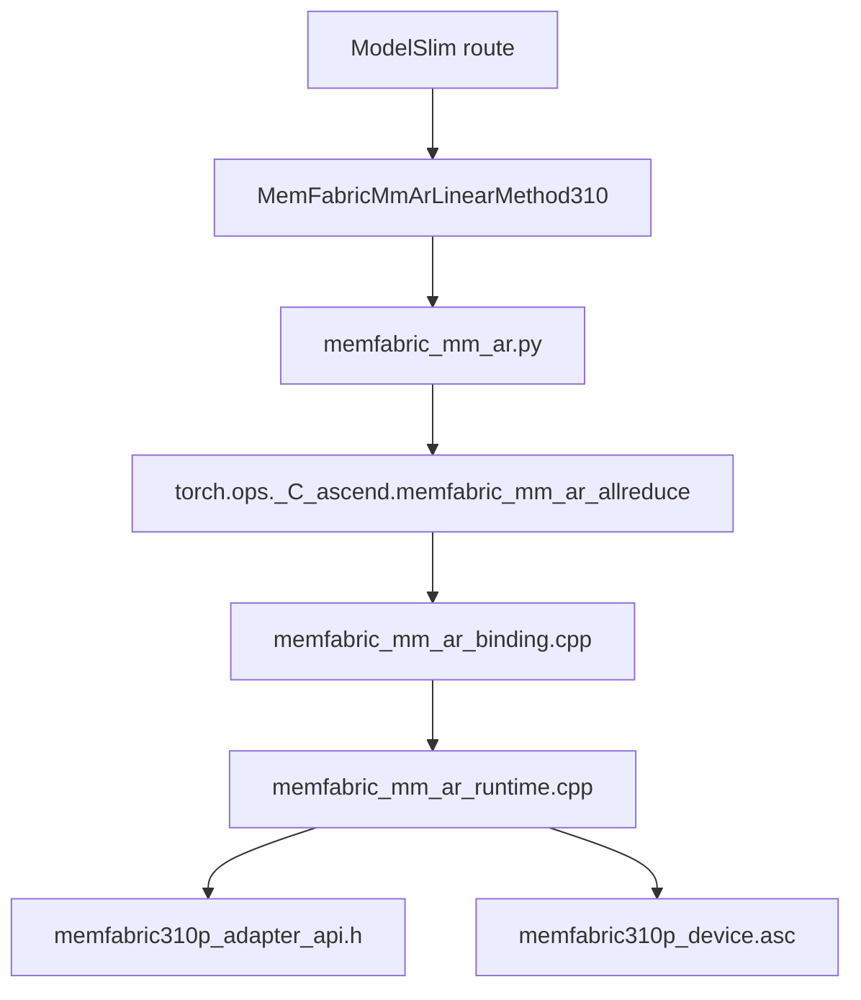

# 08｜从 Python 到 AscendC：按“所有权转移”逐层读代码

> 本章位置：主线第四幕。目标不是逐文件背函数，而是看懂：**一个普通 Linear 的计算与 TP reduction，怎样一步步把所有权交给 310P MM+AR runtime。**

---

## 1. 源码阅读总路径



阅读时始终写出两件事：

```text
这一层接过了什么责任？
这一层把什么责任继续交下去？
```

---

## 2. 第一站：ModelSlim route

文件重点：

```text
vllm_ascend/_310p/quantization/modelslim_config.py
```

你要确认：

```text
目标层是不是 skipped unquantized projection？
是否满足 MM+AR eligibility？
最终 LinearMethod 选了谁？
```

一旦选择 fused method，必须同步处理：

```text
layer.reduce_results = False
```

因为 reduction 已经由 custom op 接管。

这一步本质是“语义所有权转移”。

---

## 3. 第二站：Python op wrapper

重点：

```text
vllm_ascend/_310p/ops/memfabric_mm_ar.py
```

它应该保持薄：

```text
input contract
feature check
传 tp_rank/q
调用 torch op
```

如果你在这里看到大量通信状态机，就应该警惕分层失控。

---

## 4. 第三站：binding

文件：

```text
csrc/_310P/memfabric_mm_ar/memfabric_mm_ar_binding.cpp
```

schema 让 Python 与 C++ 对上：

```text
x
weight
tp_rank
batch_basem_count
 -> output
```

binding 负责：

```text
类型/设备入口
operator registration
feature-off behavior
```

不应该在这里实现完整流水协议。

---

## 5. 第四站：runtime 是真正的大脑

文件：

```text
csrc/_310P/memfabric_mm_ar/memfabric_mm_ar_runtime.cpp
```

它持有的状态包括：

```text
MemFabric context/layout
rank/q
arena geometry
scratch
weight slices
warmup flags
generation/wave sequence
Graph capture state
poison/error state
```

所以读 runtime 时不要按函数名散读，而按状态机读：

```text
init
 -> warmup
 -> eager execute
 -> capture
 -> replay
 -> shutdown
```

---

## 6. 第五站：adapter ABI

文件：

```text
csrc/_310P/memfabric_mm_ar/memfabric310p_adapter_api.h
```

重点不是把所有函数背下来，而是把接口分组：

```text
生命周期：create/destroy
布局：layout/geometry
波次：prepare/gate/ack
数据：signal/wait
收尾：quiet
小 M：small producer/wait/add
诊断：status/debug
```

从这些接口能反推出 runtime 与 MemFabric 的责任边界。

---

## 7. 第六站：AscendC device code

文件：

```text
csrc/_310P/memfabric_mm_ar/memfabric310p_device.asc
```

建议按四类 kernel 看：

```text
1. direct producer：MM + ready + signal
2. wait：等待 peer batch
3. add：local + peer
4. small-M：N-split + blocked add/unblock
```

先画输入输出地址，再看循环和 tiling；不要一上来陷进模板参数。

---

## 8. 一个实际的“追代码”模板

看到某个变量，例如 `batch_basem_count`：

```text
envs.py 默认值
  ↓
Python route/wrapper
  ↓
binding 参数
  ↓
runtime 锁定 q
  ↓
batch_m = 256*q
  ↓
arena geometry / kernel rows
```

这比全文搜索完函数名更容易理解它的系统影响。

---

## 9. 设计审视：当前代码分层哪里还可改进

### 当前优点

```text
模型语义 / runtime 状态 / device kernel 基本分开
MemFabric 有 ABI 隔离
310P 代码集中
```

### 可演进问题

#### eligibility 规则集中化

如果 Python、C++、kernel 各自重复 shape 假设，长期容易漂移。

可以演进为：

```text
一个共享 capability contract
 -> Python 用来 route
 -> runtime 用来 assert
 -> 测试自动生成边界 case
```

#### runtime 状态可观测性

建议继续增强 debug snapshot，让每次 hang 能回答：

```text
当前 wave/gen/q
卡在哪个 batch
最后一次 signal/wait/ack
poison 原因
```

#### 策略和机制解耦

`q=1/2/4`、small-M threshold、lookahead 应尽量变成 strategy；

ready/credit/Graph-safe lifecycle 属于 mechanism。

这样未来 autotune 不需要重写 correctness 协议。

---

## 10. 下一步

源码路径知道了，下一章专门把 MemFabric、同步、流水和 Graph 串起来，理解为什么“看起来多余”的 generation/quiet/ack 实际上是在保护资源生命周期。
