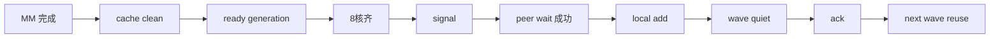

# 09｜MemFabric、同步、流水线与 Graph：为什么“通信正确”比“通信快”先一步

> 本章位置：主线第四幕。MM+AR 真正难点不在 `Y0+Y1`，而在多个 AI Core、两个 rank、异步 SDMA、复用 arena、Graph replay 同时存在时，仍然能证明每次读写的先后关系正确。

---

## 1. 先把 MemFabric 当成“搬运与同步能力”，不要脑补内部实现

vLLM 侧只应该依赖公开能力，例如：

```text
signal：宣布某段数据可以被搬/处理
wait：等待 peer 对应数据到达
quiet：确认本 wave 相关异步搬运全部收尾
ack：通知对端相关资源可以复用
```

不要把私有 mailbox/ring 结构写死进 vLLM runtime。

这就是 adapter ABI 的价值。

---

## 2. 一次 batch 到底有几种“完成”

非常容易混淆：

```text
① 某个 core 的 MM 算完
② 这个 core 写出的 C 对 SDMA 可见
③ 一个 batch 的 8 个 core 全完成
④ signal 已发
⑤ peer 数据已经到本地 recv
⑥ local add 已完成
⑦ 本 wave 所有通信不再 in-flight
⑧ peer 已允许复用 arena
```

这些不是同一个事件。

把它们压成一个 `done=true`，几乎必然埋 race。

---

## 3. 正确性最关键的 happens-before 链



任何优化都应该先说明：

> 我删掉/提前/异步化某一步后，哪条 happens-before 仍然由什么机制保证？

说不清就不能改。

---

## 4. 为什么 wait 不能每次都顺便 quiet

如果每个 batch：

```text
signal -> quiet -> wait -> add
```

会把通信队列不断 drain，后面的 SDMA 很难和下一批 MM 重叠。

当前选择：

```text
每批 wait 只确认该批 peer 数据可用
整个 wave 结束才 quiet
```

这样 later SDMA 可以继续 in-flight。

---

## 5. wave 为什么存在

arena 是复用的有限资源。

假设 wave0 还没被 peer 完全消费，wave1 就覆盖相同地址：

```text
peer 读到新旧混合数据
```

所以需要 wave-level credit：

```text
可以开始 wave?
  ↓ gate
produce/wait/add...
  ↓
quiet
  ↓
ack peer
  ↓
下一次复用
```

人话说：credit 是“这套房间现在能不能重新入住”的钥匙。

---

## 6. generation 为什么比简单 clear 更灵活

ready cell 若每轮都全部清零：

```text
先 memset control area
再开始工作
```

会有额外固定开销。

Eager 可以使用递增 generation：

```text
wave n 期待 tag = G+n
```

旧值天然不会等于新 generation，于是无需每轮清理全部 ready cell。

当前 eager generation 从高位区间开始，避免和 Graph 使用的小固定 generation 冲突。

---

## 7. 为什么 Graph 反而需要特殊处理

Graph replay 会重复同一条已捕获命令，不能依赖 host 每次生成一个新的动态 generation。

因此当前做法是：

```text
Graph capture/replay 使用固定 generation
每次 Graph 内先 clear 对应 control region
```

Eager：

```text
monotonic generation -> 少 clear
```

Graph：

```text
fixed generation + in-graph clear -> replay 安全
```

两个模式优化目标不同。

---

## 8. 为什么 warmup 不是“跑一次性能更好”这么简单

当前目标环境里 runtime/device code 还有首次 kernel symbol launch 等初始化特性。

因此 capture 前要完成：

```text
MemFabric context/layout
scratch allocation
weight slice build
kernel symbol warmup
protocol init/credit establish
```

否则 Graph 可能把“只该发生一次的初始化”录进去，或 capture 时做不允许的动态动作。

---

## 9. poison 状态为什么值得有

分布式协议一旦中途失败，不能轻易假设：

```text
对端 wave sequence
本地 arena
credit
in-flight SDMA
```

都仍然一致。

因此 runtime 记录 first failure 并进入 poisoned 状态，拒绝继续复用，是一种保守但可解释的失败策略。

shutdown 也优先尝试 quiet + stream sync；如果无法证明资源安全，不应冒险释放仍被设备使用的对象。

---

## 10. 设计审视：当前同步协议是最好的吗？

它的优势是简单、可证明，但不代表吞吐上最优。

### 当前

```text
per-core ready
per-batch signal/wait
wave-level quiet/ack
lookahead=1
```

### 候选演进

```text
ready counter/bitmap
更细 tile completion
多 wave window
ring credit
per-batch credit
设备侧 event/doorbell
Graph/eager 共用统一 epoch namespace
```

### 为什么现在不直接上更复杂协议

协议越深，状态空间按组合爆炸：

```text
乱序
覆盖
异常恢复
Graph replay
不同 batch tail
```

如果 profiler 没证明 current credit/ready 是瓶颈，复杂化没有价值。

---

## 11. 什么时候应该升级协议

看到这些证据再动：

- timeline 中 AI Core 经常因 credit/gate 空等；
- SDMA 深度不足，lookahead=1 无法隐藏通信；
- arena 空间足够但 wave-level ack 造成明显 bubble；
- ready polling 成为可见开销；
- Graph control clear 占比变得显著。

否则先优化真正暴露的阶段。

---

## 12. 下一步

同步协议已经理解，接下来要学会性能判断：

> 当前时间到底花在 MM、weight stream、signal、SDMA、wait、add、Graph 固定成本中的哪一项？
