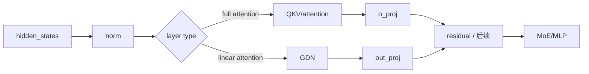

# 13｜源码精读：Qwen3.6 一层到底怎么执行

> 本章位置：主线第三幕。目标是从真实模型执行视角找到 `o_proj/out_proj`，理解它前后是什么，而不是孤立地看一个 Linear。

---

## 1. 先用“数据流”读模型，不要先陷入类继承

一层 Transformer 可以先粗化成：



本项目真正盯的是 F/G。

---

## 2. 为什么先找 `layer_type`

Qwen3.6 并不是“每一层完全相同”。

因此读源码第一步不是搜索 `o_proj`，而是先确认：

```text
这一层是 full_attention 还是 linear_attention？
```

这样才能知道它最终会走：

```text
self_attn.o_proj
或
linear_attn.out_proj
```

---

## 3. full attention 路径怎么跟

阅读时按 tensor 追：

```text
hidden_states
 -> q/k/v projection
 -> position/RoPE
 -> attention
 -> attention output
 -> o_proj
```

到了 `o_proj` 前，问三个问题：

```text
输入 shape 是什么？
TP 在哪一维切？
这层之后是否立刻需要 reduction？
```

当前目标恰好形成 RowParallel partial + SUM。

---

## 4. linear attention / GDN 路径怎么跟

不要因为它不是普通 attention 就认为融合逻辑完全不同。

要找的是同一个语义边界：

```text
GDN/linear attention 内部结果
 -> out_proj
 -> TP partial
 -> SUM
```

只要上层语义与 shape 合同满足，MM+AR 可以复用同一类 fused Linear method。

---

## 5. MoE 为什么在后面但不是本次融合对象

Attention 投影之后，模型还会继续 residual/norm/MoE 等计算。

MoE 自己有另一套并行与通信：

```text
router
 -> dispatch
 -> expert compute
 -> combine
```

所以 `o_proj` 后的 TP SUM 是一个相对干净的“局部闭合边界”，不会要求本次算子理解 expert routing。

---

## 6. 从模型层看到 TP reduction 所有权

普通 RowParallel Linear 概念：

```text
LinearMethod.apply
 -> local matmul
 -> if reduce_results:
        tensor_model_parallel_all_reduce
```

融合后：

```text
LinearMethod.apply
 -> memfabric_mm_ar_allreduce
 -> 已经是 reduced result
```

因此：

```text
reduce_results=False
```

这说明融合不是“偷偷换一个 matmul”，而是改变了模型并行语义的实现位置。

---

## 7. 源码精读时建议做一张 shape 表

每走到关键节点，记录：

| 节点 | rank 本地 shape | dtype | 是否 partial |
|---|---|---|---|
| attention output | `[M,2048]` 或对应本地维度 | FP16 | 视路径 |
| o_proj input | `[M,2048]` | FP16 | 本 rank 输入 |
| weight | `[2048,2048]` | FP16 | rank shard |
| local MM | `[M,2048]` | FP16 | 是 |
| fused output | `[M,2048]` | FP16 | 否 |

只要这张表不清楚，就不要继续读底层 kernel。

---

## 8. 设计审视：当前在 LinearMethod 层接管是不是最佳边界？

它是一个很合理的工程边界，因为：

```text
模型 forward 基本不改
RowParallel 语义仍然明确
量化 route 可以决定是否接管
custom op 可独立测试
```

但未来可能有更高层的优化 pass：

```text
模型 IR/graph 识别：RowParallelLinear + SUM
    ↓
自动替换成平台 fused implementation
```

这样模型代码甚至不需要知道 MemFabric。

### 什么情况下值得往更高层演进？

当：

- 同类模式出现在更多模型；
- 手工 layer-name route 越来越多；
- 新模型适配主要在重复“识别同一语义”；

就应该从“模型特判”升级到“图模式识别”。

---

## 9. 本章结论

真正的融合节点不是因为文件里叫 `o_proj`，而是因为源码证明它满足：

```text
RowParallel local MM
 + 紧邻 SUM reduction
 + 上下层 tensor contract 稳定
```

下一章继续沿真实执行链看 DFlash 一次 Decode 怎样准备这些 M 行。
