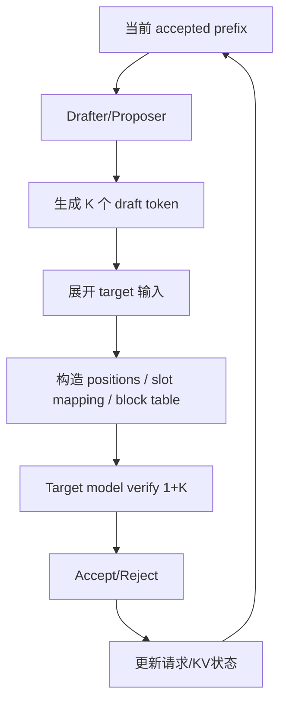

# 14｜源码精读：310P DFlash 一次 Decode 到底做了什么

> 本章位置：主线第二幕深入。目标是把“speculative decoding”从算法概念落到 310P 的输入准备、KV 地址、Graph 和 target verify。

---

## 1. 一次 speculative decode 的角色



310P 的定制重点主要落在 D/E 这类“把逻辑 token 变成设备可执行输入”的阶段。

---

## 2. 为什么通用 Triton 路径不能直接照搬

上游 DFlash/DSpark 某些 copy-and-expand 输入准备使用 Triton kernel。

310P 当前没有直接使用这条 Triton 路径，而是在：

```text
vllm_ascend/_310p/spec_decode/dflash_proposer_310.py
```

用 AscendC custom op：

```text
npu_copy_and_expand_dflash_inputs
```

替代对应输入构造。

这体现的是“算法共享，平台 materialization 特化”。

---

## 3. copy-and-expand 到底在干什么

假设一个请求有 K 个 draft token，target verify 需要一次处理：

```text
bonus/current token + K draft token
```

原来一条请求的 metadata 需要展开到多个验证位置：

```text
request id
position
slot mapping
block table lookup information
```

所以它不是简单把 token id 重复 K 次，而是为每个验证 token 算对“它属于谁、位置在哪、KV 写/读哪里”。

---

## 4. slot mapping 为什么是 correctness 核心

可以把 KV Cache 想成停车场：

```text
logical token position = 车牌
slot mapping = 它真正停在哪个车位
```

DFlash 一次增加多个候选位置，必须为每个 token 找到正确物理 slot。

如果地址算错：

```text
attention 仍可能正常执行
但读到的是别人的/旧的/空的 KV
```

这种错最危险，因为可能表现成 acceptance 下降，而不是直接 crash。

---

## 5. 为什么 block size 可能按层不同

当前 310P DFlash 代码明确处理 physical KV cache block size 的层差异。

如果错误使用一个全局 block size：

```text
slot = block_id * wrong_block_size + offset
```

逻辑位置看似对，物理地址却会错。

所以这类参数必须来自真实 layer cache geometry，而不是“模型默认值”。

---

## 6. 为什么有 int32 / Graph 相关考虑

Graph 模式下，动态 int64 地址算术、对齐等约束可能与 eager 不同。

因此 310P 路径会对某些索引计算选择更适合 Graph capture/replay 的表示方式。

这里的核心原则不是“int32 更快”，而是：

> 地址计算的 dtype 选择必须同时满足范围、对齐、Graph 和 kernel 支持。

---

## 7. 为什么最大 speculative token 是 15

当前 recurrent GDN kernel 最大 query length 预留为 16。

Target verify 需要：

```text
1 个 bonus/current token + K 个 draft
```

因此：

```text
1 + K <= 16
K <= 15
```

这是当前实现合同，不是 speculative decoding 理论极限。

---

## 8. mRoPE 为什么也必须一起正确

如果模型使用 mRoPE/特殊 position encoding，展开 token 时 position metadata 也必须按每个验证 token 正确生成。

否则：

```text
token id 对
KV slot 对
position embedding 错
```

仍会导致 target logits 不一致。

---

## 9. DFlash 怎样改变 MM+AR workload

假设 active request=10：

```text
普通 decode: 约 10 行
DFlash K=4: verify 最多约 50 行
DFlash K=8: 最多约 90 行
```

实际会受 scheduler 和 request 状态影响，但这说明：

```text
speculative K
   ↓
Target M histogram
   ↓
small-M 路径命中率
   ↓
MM+AR 最优 threshold/q
```

这条依赖必须在端到端调优时保留。

---

## 10. 设计审视：当前 DFlash 310P 特化还可以怎么演进

### 当前方式

```text
共享 proposer 算法
+ 310P custom input-expansion op
+ 310P patch 接入
```

优点：复用上游逻辑，平台差异集中。

### 下一代可能方向

```text
动态 speculative K
shape/Graph bucket 感知 K
KV geometry 预编译描述
input expansion 与 scheduler 更紧耦合
更通用的平台 kernel abstraction
```

### 什么证据会触发演进

- input expansion 在 profiler 中占比上升；
- Graph bucket 爆炸；
- acceptance 与 K 的收益曲线随 workload 波动明显；
- KV metadata 准备比 drafter 本身还贵。

这时优先优化 DFlash 系统路径，而不是继续压 target MM 几微秒。

---

## 11. 本章结论

DFlash 对本项目最关键的影响是两点：

```text
① correctness：KV/position/slot 必须完全正确
② performance：它重新塑造了 target model 的 M 分布
```

因此后面讨论 MM+AR small-M 时，必须把 DFlash 当作真实 workload 的组成部分，而不是孤立 microbenchmark。
