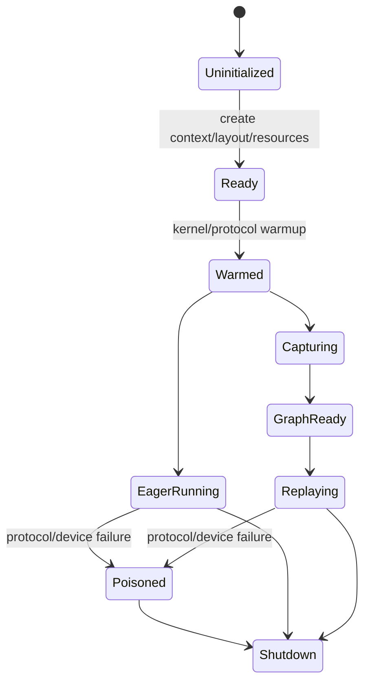

# 17｜Runtime 深度精读：arena、wave、credit、Graph 为什么都在这里

> 本章位置：主线第四幕深挖。设备 kernel 只知道“这批怎么做”；runtime 要负责“很多批、很多 wave、eager/Graph、异常、资源复用”怎样活一整个 worker 生命周期。

---

## 1. runtime 不是函数，而是一台状态机

建议把它画成：



这样读 `memfabric_mm_ar_runtime.cpp` 比逐函数看更容易。

---

## 2. 为什么 q 在 worker 生命周期里锁定

q 决定：

```text
batch_m
batch_bytes
arena geometry
batch count
ready/control layout
```

如果执行中途随便从 q=1 改 q=4，很多已经分配/协商好的地址解释都会改变。

因此当前 runtime 把 q 当作资源几何的一部分，初始化后锁定，变化需要 worker restart。

### 未来能不能动态 q？

可以，但要先把 layout 从“绑定一个 q”改成：

```text
预留最大几何
+ 每 wave 描述实际 q
```

或维护多套 arena/context。

这会增加内存和协议复杂度，所以必须先证明动态 q 的收益值得。

---

## 3. arena rows 怎样从内存预算推出来

runtime 有本地 pool 预算，例如默认约 96 MiB。

它需要容纳：

```text
send arena
recv arena
peer-recv/symmetric regions
control/ack
其它 runtime 资源
```

最终 arena rows 要：

```text
满足预算
按 batch_m 对齐
不超过实现上限（当前 8192 rows）
```

这说明 arena 大小不是随意常量，而是内存预算与协议几何的交点。

---

## 4. 一个 wave 为什么要有 sequence/generation

runtime 必须区分：

```text
这是第几轮使用同一批地址？
```

wave sequence 用于整体协议顺序；generation 用于 ready/control cell 的代际判断。

两者概念不同但协作：

```text
wave sequence：协议层“第几轮”
generation：设备 control cell“这次完成”的标签
```

---

## 5. eager generation 为什么从高值开始

当前策略让 eager generation 进入类似高位区间，例如从 `0x40000000` 起。

目的：

```text
与 Graph 使用的小固定 generation 空间分离
```

这样 eager 可以递增、不必每 wave clear 整个 ready region，同时降低和 Graph 状态碰撞风险。

---

## 6. 为什么 Graph capture 前必须把动态工作做完

capture 时应该避免第一次发生：

```text
MemFabric create
large allocation
weight slice build
首次 kernel symbol 初始化
协议 rendezvous
```

否则可能：

```text
capture 不支持
replay 地址不稳定
首次开销被录入
双 rank 生命周期不同步
```

所以 runner hook/runtime warmup 是 Graph correctness 的组成部分，不只是性能预热。

---

## 7. weight slice cache 为什么属于 runtime

small-M N-split 需要 8 份 per-core `[256,2048]` weight slice / NZ 数据。

这些 weight 对模型层生命周期很长，不应该每次 Decode 临时切。

runtime/cache 负责：

```text
第一次构建
后续复用
控制 cache entry 上限
Graph capture 前确保就绪
```

这就是典型的“把每次固定开销搬到初始化阶段”。

---

## 8. tail scratch 为什么只初始化一次

tail 只复制 valid rows，padding 可能留下旧数据。

安全性证明：

```text
每个输出 row 独立
valid output 只读取 valid rows
padding 从不进入有效结果
```

因此重复 memset 没有 correctness 必要。

注意：如果未来 kernel 改成跨行 reduction/tiling 会读 padding，这个证明就失效，必须重新评审。

这正是“优化假设要写清楚”的例子。

---

## 9. poison 为什么比“失败后继续试”安全

分布式协议失败后可能出现：

```text
rank0 认为 wave=10
rank1 还认为 wave=9
某次 SDMA 仍 in-flight
某个 ack 已丢失
```

此时继续复用 context 很容易产生二次错误甚至 silent corruption。

当前保存 first failure、进入 poisoned 状态并拒绝继续，是为了不假装协议还能恢复。

长期如果要做真正 recovery，需要显式 reset/re-handshake protocol，而不是简单清一个 error flag。

---

## 10. shutdown 为什么宁可 leak 也不能危险 free

如果无法证明设备/SDMA 已停止，直接 free context/buffer 可能出现 use-after-free。

因此 shutdown 尝试：

```text
quiet
stream sync
安全销毁
```

若证明不了安全，进程退出前保留资源比危险释放更合理。

这不是“内存管理偷懒”，而是异步设备生命周期的安全选择。

---

## 11. 设计审视：runtime 下一代最值得做什么

### 方向 1：策略机制分离

机制：

```text
arena ownership
credit
error/Graph lifecycle
```

策略：

```text
q
lookahead
small-M threshold
split mode
```

把策略抽出来后，才容易 autotune。

### 方向 2：统一 Graph-safe resource lifecycle

现在 eager/capture/replay 存在不少特殊分支。

可演进成：

```text
prepare resource epoch
 -> bind graph epoch
 -> replay many times
 -> retire epoch
```

让 Graph 成为普通状态机的一种状态，而不是旁路逻辑。

### 方向 3：可观测性

建议 debug snapshot 能直接打印：

```text
rank/q
wave/gen
arena base/rows
current batch
last signal/wait/ack
Graph state
poison reason
```

分布式 hang 时，可观测性本身就是性能研发能力。

---

## 12. 什么证据会触发 runtime 重构

- q 最优点随 M 大幅变化；
- Graph capture/replay 分支成为 bug 高频来源；
- arena credit 让设备经常空等；
- weight cache 占用或构建时间明显；
- 恢复/错误定位时间远高于开发收益。

这时应优先重构 runtime，而不是继续增加新 kernel 变体。
