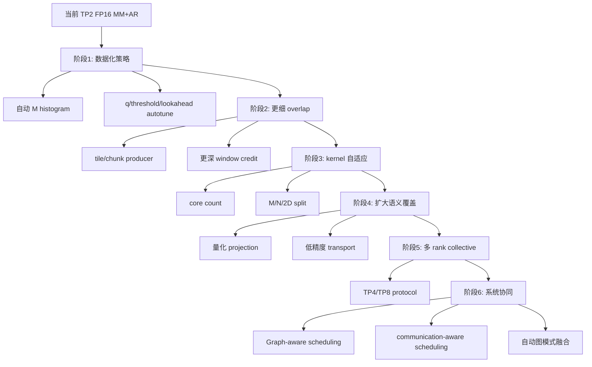

# 21｜方案审视与长期演进路线：当前实现为什么成立，又该怎样被下一版推翻

> 这一章专门做一件事：**不替当前实现辩护，而是站在评审人的角度逐项质疑它。**
>
> 目标不是证明“现在最好”，而是明确：当前方案成立需要哪些前提；哪些是 correctness 不变量；哪些只是当前性能策略；哪些方向值得成为下一代候选。

---

## 1. 先给结论：当前实现是什么性质

当前 MM+AR 更准确的定位是：

```text
在 310P3
TP=2
K/N=2048
目标 projection 为 FP16
现有 MemFabric public API
ACL Graph 生命周期约束
Qwen3.6 + DFlash workload
```

这一组条件下，一个强调：

```text
可证明正确
低侵入
可 Graph
能做计算通信 overlap
能覆盖 small-M
```

的阶段实现。

它不是：

```text
所有 NPU 最优
所有 TP 最优
所有 M 最优
所有模型最优
```

---

## 2. 把当前设计拆成“不变量”和“策略”

### Correctness 不变量

这些可以换实现，但不能丢语义：

```text
local partial 必须正确
peer partial 必须来自同一个逻辑 batch/wave
通信读取前数据必须可见
结果必须完成 SUM
arena 复用前旧消费者必须结束
Graph replay 不能误用旧 control state
异常后不能在未知协议状态上盲目继续
```

### 当前性能策略

这些都应该允许被数据推翻：

```text
8 core
M-split
small-M N-split
baseM=256
q=1 默认
lookahead=1
T stair 16/32/64/128/256
wave-level credit
FP16 transport
独立 Add kernel
```

区分这两类，后续优化才不会把 correctness 和 performance 混在一起。

---

## 3. 质疑一：8 核全部 MM + core0 signal 是最好的吗？

### 当前理由

```text
不浪费一个 AI Core
signal 工作量相对短
单 producer 语义清晰
```

### 候选

```text
7 compute + 1 protocol core
动态 designated signal core
硬件 event / independent engine
```

### 推翻条件

如果 profiler 显示：

```text
core0 因 ready polling/signal 长期拖尾
而其他 core 大量空闲
```

则应重新评估专职/轮换 signal owner。

否则专门牺牲一个 core 未必划算。

---

## 4. 质疑二：M-split 是大 M 最好的切法吗？

### 当前理由

```text
输出 layout 自然
ownership 简单
大 M 能摊薄完整 B stream
```

### 候选

```text
二维 M×N split
自适应 core count
N-split 扩展到更多 M
不同 Matmul tiling
```

### 推翻条件

如果：

```text
weight 带宽持续主导
8 core M-split scaling 差
某些 M 下核间负载不均
```

就应该重新做 split search，而不是只调 baseM。

---

## 5. 质疑三：small-M N-split 是最终答案吗？

### 当前理由

小 M 下 A 很小，B 很大；让 8 核共享 A、各读 1/8 B，可以降低每核 weight working set。

### 候选

```text
1/2/4 core M-split
2D split
persistent weight
normal-layout direct write
更细 T stair
```

### 推翻条件

如果新 CANN/硬件让 full-B stream floor 明显下降，或 unblock/add 成为主瓶颈，N-split 的优势可能消失。

所以 threshold 必须可重测。

---

## 6. 质疑四：baseM=256 与 q∈{1,2,4} 是最好粒度吗？

### 当前理由

它们在：

```text
MM 效率
通信 payload
同步次数
arena 几何
```

之间给出有限、可控的选择。

### 候选

```text
baseM=128/512
更连续的 q
按 M 动态 chunk
tile-level communication
```

### 推翻条件

当 profiler 表明：

```text
首个 signal 太晚 -> 应更细
控制开销过大 -> 应更粗
```

就该重测粒度。

固定 1MiB/2MiB/4MiB payload 不是协议真理。

---

## 7. 质疑五：lookahead=1 是最好流水深度吗？

### 当前理由

```text
实现简单
已经能产生一层计算通信重叠
资源 live range 可控
```

### 候选

```text
0
2
多 wave sliding window
```

### 推翻条件

```text
SDMA 明显暴露且 queue 有余量 -> 尝试更深
内存/反压变重 -> 变浅
```

目标不是“队列越深越先进”，而是最小深度足以隐藏暴露通信。

---

## 8. 质疑六：为什么不是边 MM 边搬边规约得更细

这是非常值得研究的下一代方向。

理想：

```text
MM tile0 -> send tile0
MM tile1 -> send tile1
peer tile0 -> add tile0
...
```

理论优势：减少尾部。

但代价：

```text
signal/wait 次数增加
控制 metadata 增加
cache clean 更碎
MemFabric API 需要支持 sub-batch completion
设备调度更复杂
```

所以正确演进顺序是：

```text
先测当前 batch 尾部暴露
 -> 算理论收益上限
 -> 测 per-chunk fixed cost
 -> 再决定是否编码
```

不是“越细越好”。

---

## 9. 质疑七：Add 为什么不直接并入 MM

候选：

```text
MM 产生 partial 后等待 peer tile，再直接累加
```

好处：少一次 output/read/add kernel。

风险：

```text
为了等 peer 阻塞 AI Core
破坏原有 MM/SDMA overlap
Matmul output 生命周期更复杂
```

只有当：

```text
Add 明显暴露在 critical path
且 peer 到达与计算空闲窗口对齐
```

才值得尝试。

否则“少一个 kernel”可能反而更慢。

---

## 10. 质疑八：为什么 transport 还是 FP16

当前简单可靠：

```text
partial 是 FP16
直接搬 FP16
直接 FP16 add
```

下一代可以研究：

```text
BF16
INT8 + scale
block quantized transport
```

但先问：

```text
通信到底暴露了多少？
```

如果 SDMA 已被 MM 隐藏，压缩 transport 的端到端收益上限接近 0，却增加量化误差和 kernel。

---

## 11. 质疑九：为什么 TP 只支持 2

因为当前协议利用了 TP2 的特殊简单性：

```text
rank0 只缺 Y1
rank1 只缺 Y0
```

双方互换一次 partial 后 local add 就结束。

TP4 不同：

```text
每个 rank 缺另外 3 份 partial
```

需要重新设计 collective：

```text
ring
reduce-scatter + allgather
树
多 peer direct exchange
```

所以长期 TP>2 不是“当前功能扩展”，而是下一代协议课题。

---

## 12. 质疑十：为什么还需要这么多 patch/route

当前做法适合快速把 310P 特化接进上游。

长期更理想：

```text
模型只声明 RowParallel SUM 语义
平台 capability registry 声明可用实现
optimizer 自动选择 stock/HCCL/MM+AR
```

甚至进一步：

```text
根据 shape/workload 自动选择 M-split/N-split/stock
```

这会把“手工特判”演进成“语义驱动优化”。

---

## 13. 质疑十一：为什么让算子适应 Scheduler，而不是让 Scheduler 适应算子

当前主要是：

```text
Scheduler 产生 M
MM+AR 被动接收 M
```

系统级下一代可以变成双向：

```text
performance model 告诉 Scheduler：
哪些 M/Graph bucket 性价比高
```

Scheduler 在不破坏公平性和 SLA 前提下，更好地拼 batch。

这是比 kernel 内继续调 2% 更大的潜在空间，但影响范围也更大，因此应后做。

---

## 14. 质疑十二：是不是应该把融合边界继续扩大

演进有三种尺度：

### 微观

```text
改 tiling / chunk / core split
```

### 中观

```text
MM + AR + residual/layout/后续 elementwise
```

### 宏观

```text
Scheduler + Graph + communication aware execution
```

选择哪层，取决于当前 profiler 的最大暴露时间在哪里。

不要默认“更大融合就更高级”。

---

## 15. 一张长期演进路线图



顺序不是死的；它表达一个原则：

> 先把“当前方案什么时候好”数据化，再扩复杂度。

---

## 16. 每个新优化都必须写“推翻条件”

以后设计文档建议固定加：

```text
### 当前结论成立前提
硬件/shape/workload/API...

### 替代方案
A/B/C

### 为什么当前没选
证据/复杂度/收益上限

### 推翻条件
出现什么数据就重新评审
```

这样文档不会变成“历史实现说明书”，而会成为后续研发的决策资产。

---

## 17. 最后的判断标准

如果你真的吃透了这个项目，面对一个新想法时，不会先问：

> 这个能不能写？

而会按顺序问：

```text
它解决的暴露时间有多大？
数学上能不能重排？
会不会破坏 happens-before？
收益上限多少？
新增固定成本多少？
真实 workload 命中率多少？
Graph/异常/维护代价多少？
什么数据出现时我会主动放弃它？
```

这才是从“会做一个融合算子”走到“会设计下一代推理系统”的真正分界线。
