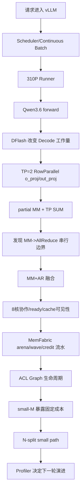

# 310P × Qwen3.6 × vLLM-Ascend 系统学习地图

> 目标不是背 API，而是最后能自己回答：**它是什么、为什么这样设计、当前做法是不是最好、什么证据能推翻它、下一代怎么演进。**
>
> 主线场景：310P3 ×2、TP=2、Tech/Qwen3.6-35B-A3B-w8a8、在线 continuous batching、DFlash、重点研究 attention/GDN 输出投影的 MM+AR。

---

## 1. 整套材料只有一条故事线



后面每一章都只是把这条链的一段放大。

---

## 2. 固定使用“七问法”，防止把现有代码当标准答案

看到任何设计，都按顺序问：

```text
1. 上一步遇到了什么真实问题？
2. 数学与数据 shape 是什么？
3. 当前代码在哪一层解决？
4. 哪些约束属于 correctness，绝对不能删？
5. 为什么当前实现可能更快？
6. 还有哪些候选方案？为什么此刻没选？
7. 什么 profiler/端到端证据出现时，应当推翻当前方案？
```

特别区分三类东西：

| 类型 | 例子 | 能不能随便改 |
|---|---|---|
| 数学约束 | `Y=Y0+Y1` | 不能破坏 |
| 协议正确性 | `MM -> clean -> ready -> signal` | 不能凭感觉删 |
| 性能策略 | q、lookahead、small-M threshold、M/N split | 应持续实验 |

---

## 3. 五幕学习路径

### 第一幕：先搞懂“服务系统”

`00 -> 01 -> 02 -> 03 -> 04`

你要知道谁决定本轮 M、谁准备 KV、TP 为什么产生 partial output、310P 定制为什么不能全部塞进一个 kernel。

### 第二幕：Decode 为什么引入 DFlash

`05 -> 14`

你要知道 draft/verify/accept 的数据流，以及 DFlash 为什么改变 MM+AR 真正看到的 M 分布。

### 第三幕：怎么从关键路径选融合点

`13 -> 06 -> 15`

重点不是“o_proj 能融合”，而是学习一套可复用的融合点评审方法。

### 第四幕：融合怎样做对、做成流水

`07 -> 08 -> 16 -> 17 -> 09 -> 19 -> 18`

从 Python route 一路读到 AscendC、MemFabric、Graph 和 small-M。

### 第五幕：证明它值得，并设计下一版

`10 -> 20 -> 21`

用模型、profiler 和 A/B 实验，而不是凭直觉宣布“已经最优”。

`11` 是实战路线，`12` 是术语索引。

---

## 4. 当前实现先钉住的事实

```text
TP = 2
目标：full_attention self_attn.o_proj
      linear_attention linear_attn.out_proj
global K = 4096
local K  = 2048
N        = 2048
目标 projection：当前 checkpoint 中走 FP16 unquantized path
baseM = 256
q ∈ {1,2,4}，当前默认 q=1
8 个 AI Core 都参与 MM
core0 完成自己的 MM 后兼任唯一 signal owner
```

`W8A8` 是模型总体量化标签，不意味着所有 Linear 都是 INT8。本次目标层被量化配置跳过，因此 MM+AR 当前处理的是 FP16 projection。

---

## 5. “当前最好”应该怎样说才严谨

不要写：

> 8 核 M-split + q=1 + lookahead=1 是最好方案。

应该写：

> 在当前 TP=2、K/N=2048、现有 MemFabric public API、当前 Graph 生命周期、已测 workload 下，这套实现是一个经过正确性约束和已有 profiling 证据筛出来的**阶段方案**。它是否继续成立，要由新的 workload、CANN 版本、runtime、通信 API 和 profiler 数据复验。

这套材料中所有性能结论都遵守这个口径。

---

## 6. 你最终必须能画出的四张图

### 请求图

```text
Scheduler -> Runner -> Qwen Layer -> Attention/GDN/MoE -> Linear -> NPU
```

### TP 数学图

```text
rank0: X0 @ W0 = Y0 --\
                         +--> Y = Y0 + Y1
rank1: X1 @ W1 = Y1 --/
```

### MM+AR pipeline 图

```text
P0
P1      || SDMA0
W0/A0   || SDMA1
P2      || ...
...
quiet
ack
```

### 正确性 happens-before 图

```text
MM -> cache clean -> ready -> signal -> peer wait -> add
                                      ... -> quiet -> ack -> next wave
```

---

## 7. 源码常驻窗口

```text
vllm_ascend/patch/worker/patch_qwen3_5.py
vllm_ascend/_310p/spec_decode/dflash_proposer_310.py
vllm_ascend/_310p/quantization/modelslim_config.py
vllm_ascend/_310p/ops/memfabric_mm_ar.py
vllm_ascend/_310p/ops/memfabric_mm_ar_runner_hooks.py

csrc/_310P/memfabric_mm_ar/memfabric_mm_ar_binding.cpp
csrc/_310P/memfabric_mm_ar/memfabric_mm_ar_runtime.cpp
csrc/_310P/memfabric_mm_ar/memfabric310p_adapter_api.h
csrc/_310P/memfabric_mm_ar/memfabric310p_device.asc

vllm_ascend/envs.py
```

---

## 8. 学完的判断标准

你应该能不看文档解释：

- 为什么 TP=2 后 local K=2048，而输出 N 仍是 2048；
- 为什么 `reduce_results=False` 是“规约所有权转移”；
- 为什么 8-core ready 是卡内协作，不是跨卡通信；
- 为什么 eager 和 Graph 的 generation 生命周期不同；
- 为什么 `quiet` 每 batch 做反而可能毁掉流水；
- 为什么 small-M 会从 M-split 演进到 N-split；
- 为什么 TP>2 已经不是当前 peer-exchange 协议简单扩容；
- 看到 profiler 后，怎样判断该改 q、lookahead、threshold、通信粒度，还是干脆换融合边界。

最后一项最重要：**会判断当前方案何时不再成立。**
